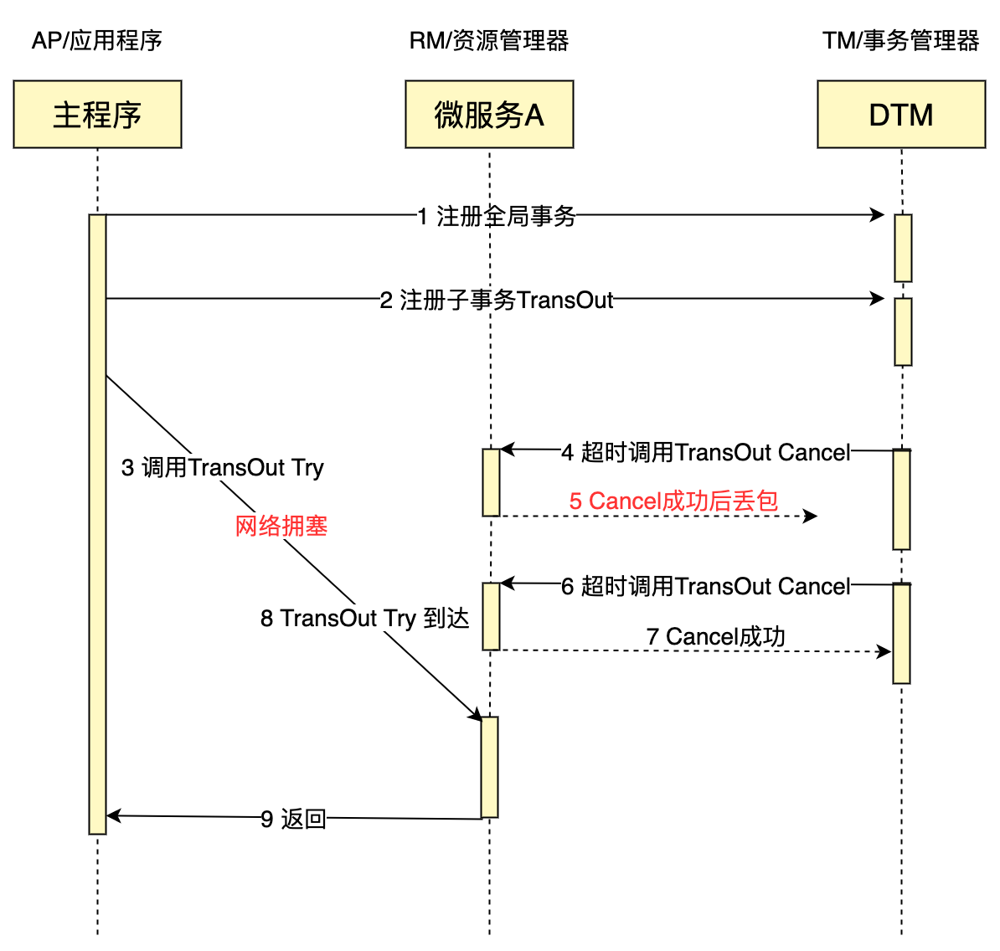

# 异常情况

下面以TCC事务说明这些异常情况：

**空回滚：**

　　在没有调用 TCC 的 Try 方法的情况下，调用了二阶段的 Cancel 方法。Cancel 方法需要识别出这是一个空回滚，然后直接返回成功。

**幂等**：

　　由于任何一个请求都可能出现网络异常，出现重复请求，所以所有的分布式事务分支，都需要保证幂等性

**悬挂：**

　　悬挂就是对于一个分布式事务，其二阶段 Cancel 接口比 Try 接口先执行。Try 方法需要识别出这是一个悬挂，然后直接返回失败。

下面看一个网络异常的时序图，更好的理解上述几种问题

- 业务处理请求4的时候，Cancel在Try之前执行，需要处理空回滚
- 业务处理请求6的时候，Cancel重复执行，需要幂等
- 业务处理请求8的时候，Try在Cancel后执行，需要处理悬挂

面对上述复杂的网络异常情况，目前看到各个分布式事务框架给出的建议方案主要是：

业务方通过唯一键，去查询相关联的操作是否已完成，如果已完成则直接返回成功。

这种方案，相关的判断逻辑较复杂，易出错，业务负担重。我们将在下一节提出dtm独创的方案。
