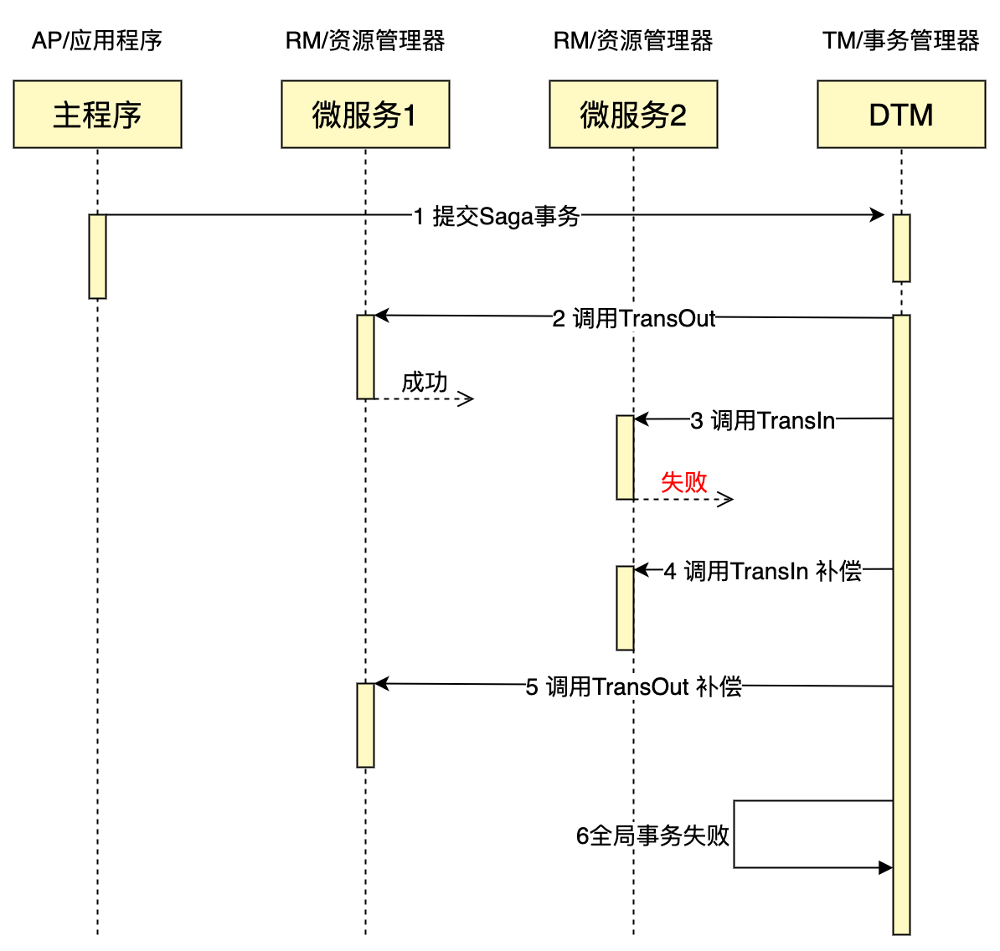

# 介绍

## DTM是什么

DTM是首款golang分布式事务管理框架，与其他框架不同的是，DTM提供了极简单的HTTP、GRPC接入方式，支持多语言，并且在框架层处理了各类子事务乱序难题。

您可以在[为什么选DTM](./why)中了解更多DTM的设计初衷。

## 亮点

* 极易接入
  - 支持HTTP、GRPC，提供非常简单的接口，极大降低上手分布式事务的难度，新手也能快速接入
* 使用简单
  - 开发者不再担心悬挂、空补偿、幂等各类问题，框架层代为处理
* 跨语言
  - 可适合多语言栈的公司使用。方便go、python、php、nodejs、ruby各类语言使用。
* 易部署、易扩展
  - 仅依赖mysql，部署简单，易集群化，易水平扩展
* 多种分布式事务协议支持
  - TCC、SAGA、XA、事务消息

受邀参加中国数据库大会分享[多语言环境下分布式事务实践](http://dtcc.it168.com/yicheng.html#b9)

## 谁在使用dtm

[Ivydad 常青藤爸爸](https://ivydad.com)

[Eglass 视咖镜小二](https://epeijing.cn)

<a style="
    background-color:#646cff;
    font-size: 0.9em;
    color: #fff;
    margin: 0.2em 0;
    width: 200px;
    text-align: center;
    padding: 12px 24px;
    display: inline-block;
    vertical-align: middle;
    border-radius: 2em;
    font-weight: 600;
" href="../other/opensource">与seata对比</a>

## 起步

::: tip 具备的基础知识
本教程假设您已具备分布式事务相关的基础知识，如果您对这方面并不熟悉，可以阅读[分布式事务理论](../guide/theory)

本教程也假设您有一定的编程基础，能够大致明白GO语言的代码，如果您对这方面并不熟悉，可以访问[golang](https://golang.google.cn/)
:::

- [安装](./install)，使用go语言推荐的方式

尝试DTM的最简单的方法是使用QuickStart例子，该例子的主要文件在[dtm/example/quick_start.go](https://github.com/yedf/dtm/blob/main/examples/quick_start.go)。

您可以在dtm目录下，通过下面命令运行这个例子

`go run app/main.go quick_start`

在这个例子中，创建了一个saga分布式事务，然后提交给dtm，核心代码如下：

``` go
	req := &gin.H{"amount": 30} // 微服务的载荷
	// DtmServer为DTM服务的地址
	saga := dtmcli.NewSaga(DtmServer, dtmcli.MustGenGid(DtmServer)).
		// 添加一个TransOut的子事务，正向操作为url: qsBusi+"/TransOut"， 逆向操作为url: qsBusi+"/TransOutCompensate"
		Add(qsBusi+"/TransOut", qsBusi+"/TransOutCompensate", req).
		// 添加一个TransIn的子事务，正向操作为url: qsBusi+"/TransIn"， 逆向操作为url: qsBusi+"/TransInCompensate"
		Add(qsBusi+"/TransIn", qsBusi+"/TransInCompensate", req)
	// 提交saga事务，dtm会完成所有的子事务/回滚所有的子事务
	err := saga.Submit()
```

该分布式事务中，模拟了一个跨行转账分布式事务中的场景，全局事务包含TransOut（转出子事务）和TransIn（转入子事务），每个子事务都包含正向操作和逆向补偿，定义如下：

``` go
func qsAdjustBalance(uid int, amount int) (interface{}, error) {
	err := dbGet().Transaction(func(tx *gorm.DB) error {
		return tx.Model(&UserAccount{}).Where("user_id = ?", uid).Update("balance", gorm.Expr("balance + ?", amount)).Error
	})
	if err != nil {
		return nil, err
	}
	return M{"dtm_result": "SUCCESS"}, nil
}

func qsAddRoute(app *gin.Engine) {
	app.POST(qsBusiAPI+"/TransIn", common.WrapHandler(func(c *gin.Context) (interface{}, error) {
		return qsAdjustBalance(2, 30)
	}))
	app.POST(qsBusiAPI+"/TransInCompensate", common.WrapHandler(func(c *gin.Context) (interface{}, error) {
		return qsAdjustBalance(2, -30)
	}))
	app.POST(qsBusiAPI+"/TransOut", common.WrapHandler(func(c *gin.Context) (interface{}, error) {
		return qsAdjustBalance(1, -30)
	}))
	app.POST(qsBusiAPI+"/TransOutCompensate", common.WrapHandler(func(c *gin.Context) (interface{}, error) {
		return qsAdjustBalance(1, 30)
	}))
}
```

整个事务最终成功完成，时序图如下：


在实际的业务中，子事务可能出现失败，例如转入的子账号被冻结导致转账失败。我们对业务代码进行修改，让TransIn的正向操作失败，然后看看结果

``` go
	app.POST(qsBusiAPI+"/TransIn", common.WrapHandler(func(c *gin.Context) (interface{}, error) {
		return M{"dtm_result": "FAILURE"}, nil
	}))
```

再运行这个例子，整个事务最终失败，时序图如下：



在转入操作失败的情况下，TransIn和TransOut的补偿分支被执行，保证了最终的余额和转账前是一样的。

## 准备好了吗？

我们刚才简单介绍了一个完整的分布式事务，包括了一个成功的，以及一个回滚的。现在您应该对分布式事务有了具体的认识，本教程将带你逐步学习处理分布式事务的技术方案和技巧。

## 交流群

请加 yedf2008 好友或者扫码加好友，验证回复 dtm 按照指引进群


如果您觉得[dtm](https://github.com/yedf/dtm)不错，或者对您有帮助，请赏颗星吧！
