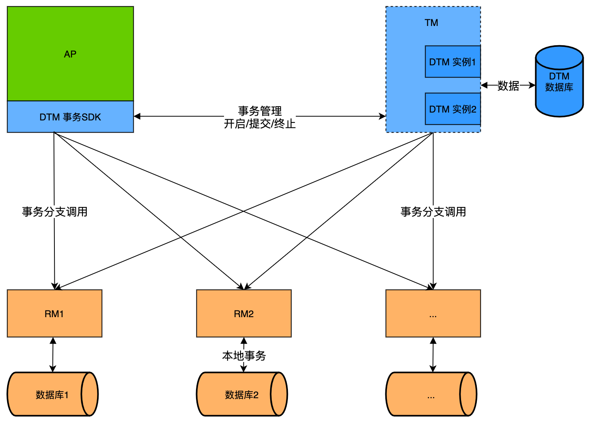

# DTM架构

我们先简单介绍一个完整的分布式事务，大家了解了分布式事务的过程后，再详细介绍DTM的架构。

## 分布式事务过程

假设我们要进行一个跨行转账，A转给B30元，因为A、B不在同一个同一个数据库，无法通过本地事务解决，因此使用了SAGA分布式事务来解决这个问题，下面是一个成功的SAGA事务（更多SAGA详情，参考[SAGA](./saga)）的时序图：

在这个时序图中，TransOut，TransIn都完成后，全局事务完成。

## DTM架构图

整个DTM架构中，一共有三个角色，分别承担了不同的功能

- RM-资源管理器：RM是一个应用服务，负责管理全局事务中的本地事务，他通常会连接到一个数据库，负责相关数据的修改、提交、回滚、补偿等操作。例如在前面的这个SAGA事务中，TransIn，TransOut即为RM，负责A、B账户余额的修改
- AP-应用程序：AP是一个应用服务，负责全局事务的编排，他会注册全局事务，按照业务规则，注册子事务，调用RM接口。例如在前面的这个SAGA事务中，负责提交一个包含了TransOut、TransIn的全局事务
- TM-事务管理器：TM就是DTM服务，负责全局事务的管理，每个全局事务在TM注册，每个事务分支也注册到TM。TM会协调所有的RM，将同一个全局事务的不同分支，全部提交或全部回滚。例如在前面的SAGA事务中，TM负责了调用各个RM，最终完成这个全局事务

## 高可用
在上述这个架构中，TM不是单点，而是一个服务集群。集群由多个dtm实例进程构成，多个dtm实例访问一个共享的高可用数据库（可以选Redis/Mysql/Postgres）。

几乎所有的云厂商都会提供高可用的数据库，几乎所有要求业务高可用的公司内部，都会有高可用的数据库，因此将dtm对接到一个高可用数据库是毫无困难的。

在实际的生产部署中，DTM是多实例的，连接的共享存储是高可用的，因此不存在单点，从而提供了高可用的TM服务。

## 多进程同时轮询

全局事务的运行过程中，可能出现各种网络错误，导致全局事务无法一次完成，需要定时重试。DTM（默认配置下）会在每个进程实例中，去轮询超时需要处理的全局任务。为了保证上述高可用多进程部署中，一个超时任务不会被多个实例同时取出，dtm使用了类似乐观锁的机制，保证一个任务只会被一个dtm实例取出。

## 术语

假设一个嵌套事务如下所示：

依据上述的架构和事务过程，我们定义几个常见的术语如下：

- 事务分支：我们把每个服务管理的全局事务组成部分，称为事务分支，Accout服务会在全局事务上，注册一个事务分支
- 分支操作：对于Accout服务，在TCC事务模式下，会实现Try/Confirm/Cancel三个操作，多个分支操作配合完成一个分支事务
- 本地事务：Accout服务可能访问一个数据库，创建一个本地事务，也可能访问多个数据库，创建多个本地事务

## 与XA DTP模型异同
DTM的架构和角色，与X/Open XA的DTP模型一致，RM、AP、TM担当的功能都是一致的，只是将XA的DTP模型拓展到了服务/微服务架构上。

## 跨语言特性
dtm本身由Go编写，他提供了多语言分布式事务的支持，主要是通过非常薄的各语言SDK做到

