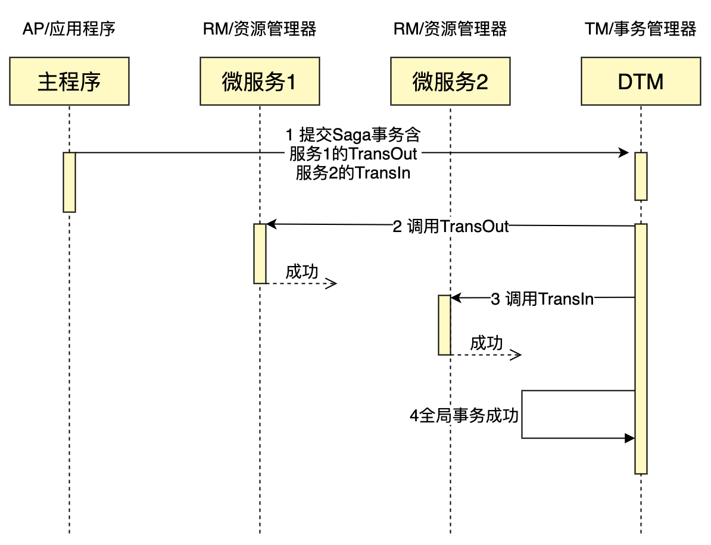

# SAGA事务模式

SAGA事务模式是DTM中最常用的模式，主要是因为SAGA模式简单易用，工作量少，并且能够解决绝大部分业务的需求。

SAGA最初出现在1987年Hector Garcaa-Molrna & Kenneth Salem发表的论文[SAGAS](https://www.cs.cornell.edu/andru/cs711/2002fa/reading/sagas.pdf)里。其核心思想是将长事务拆分为多个短事务，由Saga事务协调器协调，如果每个短事务都成功提交文成，那么全局事务就正常完成，如果某个步骤失败，则根据相反顺序一次调用补偿操作。

## 拆分为子事务
例如我们要进行一个类似于银行跨行转账的业务，将A中的30元转给B，根据Saga事务的原理，我们将整个全局事务，切分为以下服务：
- 转出（TransOut）服务，这里转出将会进行操作A-30
- 转出补偿（TransOutCompensate）服务，回滚上面的转出操作，即A+30
- 转入（TransIn）服务，转入将会进行B+30
- 转出补偿（TransInCompensate）服务，回滚上面的转入操作，即B-30

整个SAGA事务的逻辑是：

执行转出成功=>执行转入成功=>全局事务完成

如果在中间发生错误，例如转入B发生错误，则会调用已执行分支的补偿操作，即：

执行转出成功=>执行转入失败=>执行转入补偿成功=>执行转出补偿成功=>全局事务回滚完成

下面我们看一个成功完成的SAGA事务典型的时序图：



在这个图中，我们的全局事务发起人，将整个全局事务的编排信息，包括每个步骤的正向操作和反向补偿操作定义好之后，提交给服务器，服务器就会按步骤执行前面SAGA的逻辑。
## SAGA的接入

我们看看Go如何接入一个SAGA事务

``` go
req := &gin.H{"amount": 30} // 微服务的请求Body
// DtmServer为DTM服务的地址
saga := dtmcli.NewSaga(DtmServer, dtmcli.MustGenGid(DtmServer)).
  // 添加一个TransOut的子事务，正向操作为url: qsBusi+"/TransOut"， 逆向操作为url: qsBusi+"/TransOutCompensate"
  Add(qsBusi+"/TransOut", qsBusi+"/TransOutCompensate", req).
  // 添加一个TransIn的子事务，正向操作为url: qsBusi+"/TransIn"， 逆向操作为url: qsBusi+"/TransInCompensate"
  Add(qsBusi+"/TransIn", qsBusi+"/TransInCompensate", req)
// 提交saga事务，dtm会完成所有的子事务/回滚所有的子事务
err := saga.Submit()
```

详细例子代码参考[dtm-examples](https://github.com/dtm-labs/dtm-examples)

我们前面的的例子，是基于HTTP协议SDK进行DTM接入，gRPC协议的接入基本一样，详细例子代码可以在[dtm-examples](https://github.com/dtm-labs/dtm-examples)

上面的代码首先创建了一个SAGA事务，然后添加了两个子事务TransOut、TransIn，每个事务分支包括action和compensate两个操作，分别为Add函数的第一第二个参数。子事务定好之后提交给dtm。dtm收到saga提交的全局事务后，会调用所有子事务的正向操作，如果所有正向操作成功完成，那么事务成功结束。

### 失败回滚

如果有正向操作失败，那么dtm会调用各分支的补偿操作，进行回滚，最后事务成功回滚。

我们将上述的第二个分支调用，传递参数，让他失败

``` go
  Add(qsBusi+"/TransIn", qsBusi+"/TransInCompensate", &TransReq{Amount: 30, TransInResult: "FAILURE"})
```

失败的时序图如下：


::: tip 回滚分支并发执行
请注意，在SAGA的论文中，回滚是按照顺序回滚的，但是DTM在回滚时，是并发回滚的，主要目的是为了更快速推进，让全局事务完成。从实际业务需求来看，许多常见的正向操作是需要按顺序执行，但是回滚操作，则不需要按照顺序执行。

目前DTM的SAGA事务模式下，所有的补偿操作是并发执行的，因此对于应用开发者来说，请不要依赖回滚的顺序。
:::

### 补偿操作异常

假如补偿操作遇见失败会怎么样？按照Saga模式的协议，补偿操作是不允许失败的，遇见失败的情况，都是由于临时故障或者程序bug。dtm在补偿操作遇见失败时，会不断进行重试，直到成功。

关于这部分的更详细的论述，参见[不允许失败](./must-succeed)
## 并发SAGA

论文里面的SAGA提到了事务分支并发执行模式，这种模式，能够缩短SAGA事务的总执行时间，DTM对此也进行了支持：

并发SAGA通过EnableConcurrent()打开，当saga提交后，多个事务分支之间是并发执行。DTM也支持指定事务分支之间的依赖关系，可以指定特定任务A执行完成之后才能够执行任务B。


### http

``` go
  req := &TransReq{Amount: 30}
  csaga := dtmcli.NewSaga(DtmServer, dtmcli.MustGenGid(DtmServer)).
    Add(Busi+"/TransOut", Busi+"/TransOutRevert", req).
    Add(Busi+"/TransOut", Busi+"/TransOutRevert", req).
    Add(Busi+"/TransIn", Busi+"/TransInRevert", req).
    Add(Busi+"/TransIn", Busi+"/TransInRevert", req).
    EnableConcurrent(). // 打开并发开关
    AddBranchOrder(2, []int{0, 1}). // 这里指定 branch 2 需要在 branch 0, branch 1之后执行
    AddBranchOrder(3, []int{0, 1}) // 这里指定 branch 3 需要在 branch 0, branch 1之后执行
  err := csaga.Submit()
```

详细例子代码参考[dtm-examples](https://github.com/dtm-labs/dtm-examples)

### 失败回滚

并发SAGA如果出现回滚，那么所有回滚的补偿操作会全部并发执行，不再考虑前面的任务依赖。

由于并发SAGA的正向操作和补偿操作都是并发执行的，因此更容易出现空补偿和悬挂情况，需要参考DTM的子事务屏障环节妥善处理

