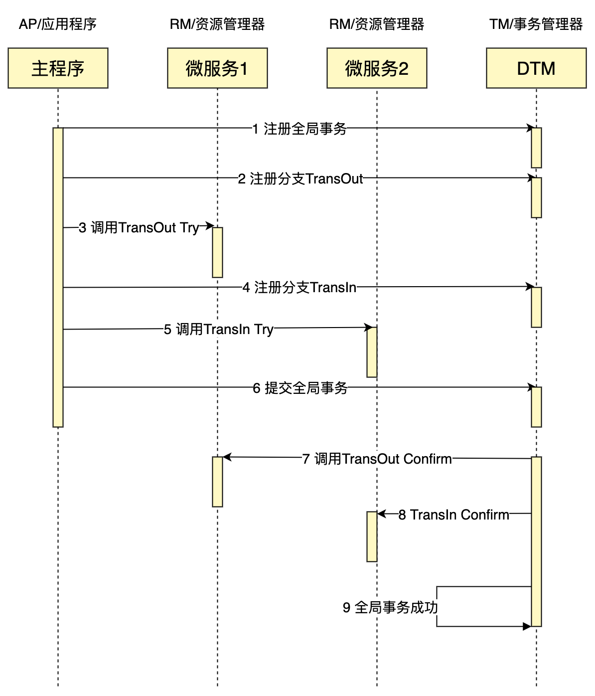

# TCC事务模式
什么是TCC，TCC是Try、Confirm、Cancel三个词语的缩写，最早是由 Pat Helland 于 2007 年发表的一篇名为《Life beyond Distributed Transactions:an Apostate’s Opinion》的论文提出。

## TCC组成
TCC分为3个阶段

- Try 阶段：尝试执行，完成所有业务检查（一致性）, 预留必须业务资源（准隔离性）
- Confirm 阶段：如果所有分支的Try都成功了，则走到Confirm阶段。Confirm真正执行业务，不作任何业务检查，只使用 Try 阶段预留的业务资源
- Cancel 阶段：如果所有分支的Try有一个失败了，则走到Cancel阶段。Cancel释放 Try 阶段预留的业务资源。

如果我们要进行一个类似于银行跨行转账的业务，转出（TransOut）和转入（TransIn）分别在不同的微服务里，一个成功完成的TCC事务典型的时序图如下：



## 简单的TCC

我们来完成一个最简单的TCC：

``` go
err := dtmcli.TccGlobalTransaction(DtmServer, gid, func(tcc *dtmcli.Tcc) (rerr error) {
  res1, rerr := tcc.CallBranch(&TransReq{Amount: 30}, Busi+"/TransOut", Busi+"/TransOutConfirm", Busi+"/TransOutRevert")
  e2p(rerr)
  res2, rerr := tcc.CallBranch(&TransReq{Amount: 30}, Busi+"/TransIn", Busi+"/TransInConfirm", Busi+"/TransInRevert")
  logrus.Printf("tcc returns: %s, %s", res1.String(), res2.String())
  return
})
```

调用TccGlobalTransaction会开启一个全局的tcc事务。他的声明如下：

``` go
// TccGlobalTransaction begin a tcc global transaction
// dtm dtm服务器地址
// gid 全局事务id
// tccFunc tcc事务函数，里面会定义全局事务的分支
func TccGlobalTransaction(dtm string, gid string, tccFunc TccGlobalFunc) (rerr error)
```

开启成功之后，会调用第三个参数传递的函数tccFunc。我们在这个函数的内部调用了CallBranch来定义了两个子事务TransOut和TransIn。

``` go
// CallBranch call a tcc branch
// 函数首先注册子事务的所有分支，成功后调用try分支，返回try分支的调用结果
func (t *Tcc) CallBranch(body interface{}, tryURL string, confirmURL string, cancelURL string) (*resty.Response, error)
```

当tccFunc正常返回时，TccGlobalTransaction会提交全局事务，然后返回给调用者。dtm收到提交请求，则会调用所有注册子事务的二阶段Confirm分支。TccGlobalTransaction返回时，一阶段的Try已经全部完成，但是二阶段的Confirm通常还未完成。

### 失败回滚

如果tccFunc返回错误，TccGlobalTransaction会终止全局事务，然后返回给调用者。dtm收到终止请求，则会调用所有注册子事务的二阶段Cancel分支。

我们将上述的第二个分支调用，传递参数，让他失败

``` go
res2, rerr := tcc.CallBranch(&TransReq{Amount: 30, TransInResult: "FAILURE"}, Busi+"/TransIn", Busi+"/TransInConfirm", Busi+"/TransInRevert")
```

失败的时序图如下：


## 嵌套的TCC

tcc支持嵌套的子事务，代码如下(摘自[examples/main_tcc](https://github.com/yedf/dtm/blob/main/examples/main_tcc.go))：

``` go
err := dtmcli.TccGlobalTransaction(DtmServer, gid, func(tcc *dtmcli.Tcc) (rerr error) {
  res1, rerr := tcc.CallBranch(&TransReq{Amount: 30}, Busi+"/TransOut", Busi+"/TransOutConfirm", Busi+"/TransOutRevert")
  e2p(rerr)
  res2, rerr := tcc.CallBranch(&TransReq{Amount: 30}, Busi+"/TransInTccParent", Busi+"/TransInConfirm", Busi+"/TransInRevert")
  e2p(rerr)
  logrus.Printf("tcc returns: %s, %s", res1.String(), res2.String())
  return
})
```

这里的TransInTccParent子事务，里面会再调用TransIn子事务，代码如下：

``` go
	app.POST(BusiAPI+"/TransInTccParent", common.WrapHandler(func(c *gin.Context) (interface{}, error) {
		tcc, err := dtmcli.TccFromReq(c)
		e2p(err)
		req := reqFrom(c)
		logrus.Printf("TransInTccParent ")
		_, rerr := tcc.CallBranch(&TransReq{Amount: req.Amount}, Busi+"/TransIn", Busi+"/TransInConfirm", Busi+"/TransInRevert")
		e2p(rerr)
		return M{"dtm_result": "SUCCESS"}, nil
	}))
```

子事务嵌套时，从传入的请求中构建tcc对象，然后就能够正常使用tcc对象，进行相关的事务。

更多子事务嵌套的文档细节，例如相关的流程图，待补充

### 小结

在本节的教程中，我们简单介绍了TCC的理论知识，也通过几个例子，完整给出了编写一个TCC事务的过程，涵盖了正常成功完成，以及失败回滚的情况。另外还演示一个嵌套子事务。
