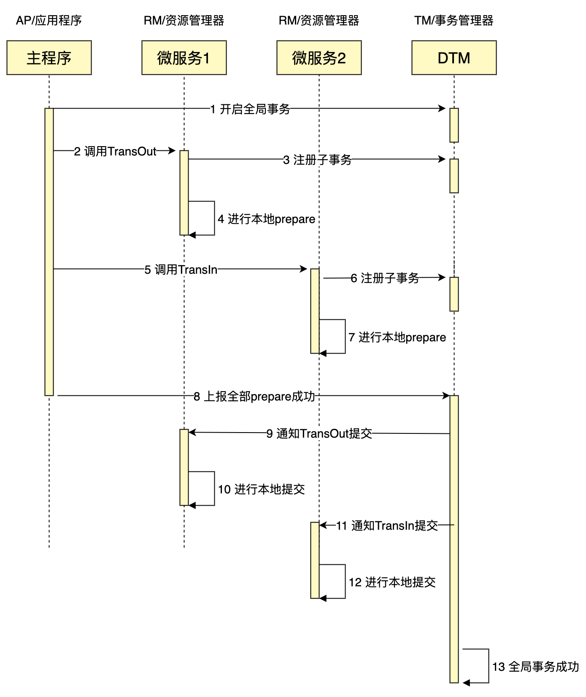

# XA事务模式

## XA是什么

XA是由X/Open组织提出的分布式事务的规范，XA规范主要定义了(全局)事务管理器(TM)和(局部)资源管理器(RM)之间的接口。本地的数据库如mysql在XA中扮演的是RM角色

XA一共分为两阶段：

第一阶段（prepare）：即所有的参与者RM准备执行事务并锁住需要的资源。参与者ready时，向TM报告已准备就绪。
第二阶段 (commit/rollback)：当事务管理者(TM)确认所有参与者(RM)都ready后，向所有参与者发送commit命令。

目前主流的数据库基本都支持XA事务，包括mysql、oracle、sqlserver、postgre

我们看看本地数据库是如何支持XA的：

第一阶段 准备

``` sql
XA start '4fPqCNTYeSG' -- 开启一个 xa 事务
UPDATE `user_account` SET `balance`=balance + 30,`update_time`='2021-06-09 11:50:42.438' WHERE user_id = '1'
XA end '4fPqCNTYeSG'
XA prepare '4fPqCNTYeSG' -- 此调用之前，连接断开，那么事务会自动回滚，这个调用之后，需要 xa commit/rollback 才会最终完成事务
-- 当所有的参与者完成了prepare，就进入第二阶段 提交
xa commit '4fPqCNTYeSG'
```

## XA实战

我们来完成一个完整的XA，我们先看一个成功的XA时序图：



### HTTP接入
我们来看看如何用使用HTTP接入一个dtm的XA事务
``` go
	gid := dtmcli.MustGenGid(dtmutil.DefaultHTTPServer)
	err := dtmcli.XaGlobalTransaction(dtmutil.DefaultHTTPServer, gid, func(xa *dtmcli.Xa) (*resty.Response, error) {
		resp, err := xa.CallBranch(&busi.TransReq{Amount: 30}, busi.Busi+"/TransOutXa")
		if err != nil {
			return resp, err
		}
		return xa.CallBranch(&busi.TransReq{Amount: 30}, busi.Busi+"/TransInXa")
	})

app.POST(BusiAPI+"/TransInXa", dtmutil.WrapHandler2(func(c *gin.Context) interface{} {
	return dtmcli.XaLocalTransaction(c.Request.URL.Query(), BusiConf, func(db *sql.DB, xa *dtmcli.Xa) error {
		return AdjustBalance(db, TransInUID, reqFrom(c).Amount, reqFrom(c).TransInResult)
	})
}))
app.POST(BusiAPI+"/TransOutXa", dtmutil.WrapHandler2(func(c *gin.Context) interface{} {
	return dtmcli.XaLocalTransaction(c.Request.URL.Query(), BusiConf, func(db *sql.DB, xa *dtmcli.Xa) error {
		return AdjustBalance(db, TransOutUID, reqFrom(c).Amount, reqFrom(c).TransOutResult)
	})
}))
```

详细例子代码参考[dtm-examples](https://github.com/dtm-labs/dtm-examples)：

上面的代码首先注册了一个全局XA事务，然后添加了两个子事务TransOut、TransIn。子事务全部执行成功之后，提交给dtm。dtm收到提交的xa全局事务后，会调用所有子事务的xa commit，完成整个xa事务。

### 失败回滚

如果有一阶段prepare操作失败，那么dtm会调用各子事务的xa rollback，进行回滚，最后事务成功回滚。

我们在上述XaFireRequest的请求负荷中，传递TransInResult=FAILURE，让他失败

``` go
req := &busi.TransReq{Amount: 30, TransInResult: "FAILURE"}
```

失败的时序图如下：


### 注意点
- dtm的XA事务接口在 v1.13.0 做了一次变更，大幅简化了XA事务的使用，整体上与TCC的接口保持一致，更易于上手。
- XA事务的第二阶段处理，即分支的最终提交或回滚，也会发往 API `BusiAPI+"/TransOutXa"`，在这个服务的内部，`dtmcli.XaLocalTransaction`会自动做`xa commit | xa rollback`， 此时请求的body为nil，因此解析body之类的操作，如前面的`reqFrom`需要放在`XaLocalTransaction`内部，否则会解析body出错.

### 小结
XA事务的特点是：
- 简单易理解
- 开发较容易，回滚之类的操作，由底层数据库自动完成
- 对资源进行了长时间的锁定，并发度低，不适合高并发的业务
