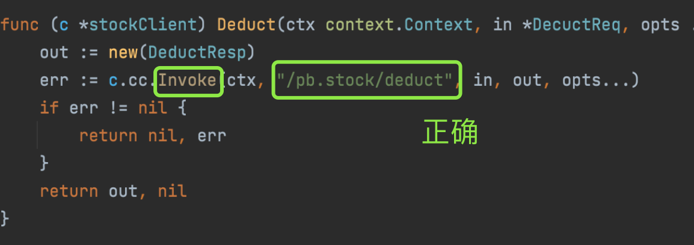

# go-zero支持
dtm从v1.6.0开始原生支持go-zero微服务框架，go-zero的版本需要v1.2.4以上

## 运行一个已有的示例
我们以etcd作为注册服务中心，可以按照如下步骤运行一个go-zero的示例：

- 配置dtm
```
MicroService:
  Driver: 'dtm-driver-gozero' # 配置dtm使用go-zero的微服务协议
  Target: 'etcd://localhost:2379/dtmservice' # 把dtm注册到etcd的这个地址
  EndPoint: 'localhost:36790' # dtm的本地地址
```
- 启动etcd
```
# 前提，已安装etcd
etcd
```
- 运行一个go-zero的服务
```
git clone github.com/yedf/dtmdriver-clients && cd dtmdriver-clients
cd gozero/trans && go run trans.go
```
- 发起一个go-zero使用dtm的事务
```
# 在dtmdriver-clients的目录下
cd gozero/app && go run main.go
```

当您在trans的日志中看到
```
2021/12/03 15:44:05 transfer out 30 cents from 1
2021/12/03 15:44:05 transfer in 30 cents to 2
2021/12/03 15:44:05 transfer out 30 cents from 1
2021/12/03 15:44:05 transfer out 30 cents from 1
```
那就是事务正常完成了

## 开发接入
参考[dtmdriver-clients](https://github.com/yedf/dtmdriver-clients/blob/main/gozero/app/main.go)的代码

``` go
// 下面这行导入gozero的dtm驱动
import _ "github.com/yedf/dtmdriver-gozero"

// 使用dtm的客户端dtmgrpc之前，需要执行下面这行调用，告知dtmgrpc使用gozero的驱动来如何处理gozero的url
err := dtmdriver.Use("dtm-driver-gozero")
// check err

// dtm已经通过前面的配置，注册到下面这个地址，因此在dtmgrpc中使用该地址
var dtmServer = "etcd://localhost:2379/dtmservice"

// 下面从配置文件中Load配置，然后通过BuildTarget获得业务服务的地址
var c zrpc.RpcClientConf
conf.MustLoad(*configFile, &c)
busiServer, err := c.BuildTarget()

  // 使用dtmgrpc生成一个消息型分布式事务并提交
	gid := dtmgrpc.MustGenGid(dtmServer)
	msg := dtmgrpc.NewMsgGrpc(dtmServer, gid).
    // 事务的第一步为调用trans.TransSvcClient.TransOut
    // 可以从trans.pb.go中找到上述方法对应的Method名称为"/trans.TransSvc/TransOut"
    // dtm需要从dtm服务器调用该方法，所以不走强类型，而是走动态的url: busiServer+"/trans.TransSvc/TransOut"
		Add(busiServer+"/trans.TransSvc/TransOut", &busi.BusiReq{Amount: 30, UserId: 1}).
		Add(busiServer+"/trans.TransSvc/TransIn", &busi.BusiReq{Amount: 30, UserId: 2})
	err := msg.Submit()

```

整个开发接入的过程很少，前面的注释已经很清晰，就不再赘述了


## 注意事项

1、在去找*.pb.go的文件中的grpc访问的方法路径时候，一定要找invoke的路径

正确



错误

